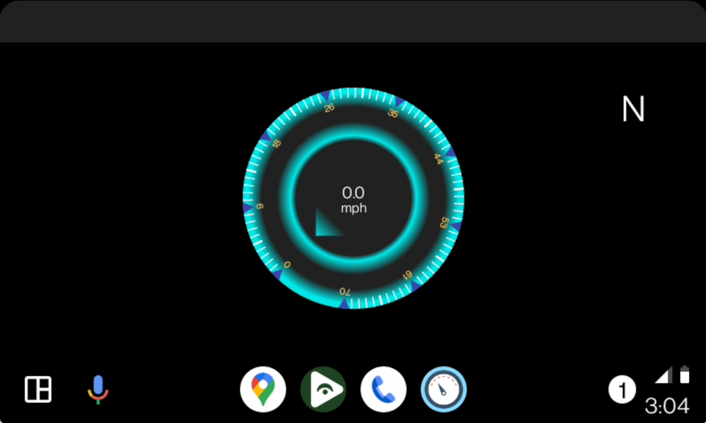

# Speedometer for Android Auto

## Install 
Install APK with KingInstaller so that Android Auto will see it.

Grant Location permissions via Android Settings -> Apps -> Speedometer

## Usage
Tapping the speedometer on the screen alternates between MPH and KPH.

There is a compass direction in the top right.

## Thanks to
I learned how to write Android Auto apps from:
- https://github.com/AndreyPavlenko/Fermata

I used the AwesomeSpeedometer from:
- https://github.com/anastr/SpeedView 
